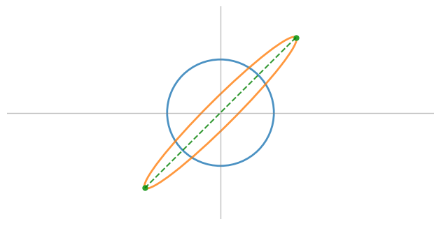

# Math for Transformers
**Third lecture: Fri Sep 27**  
Scribe: Themis Nikas

## Revision of Previous Lecture

### Courant-Fisher Theorem

Let $A$ be a symmetric matrix with eigenvalues $\lambda_1 \leq \dots \leq \lambda_n$.

The theorem states that:

$$\max_{\|x\| = 1} x^T A x = \lambda_n$$

where  $x^T A x$ is a bilinear form, and the maximum is taken over all unit vectors $x$. The eigenvalue $\lambda_n$ is the largest eigenvalue of the matrix $A$.

***Why it is an interesting theorem? -It connects Linear Algebra with Optimization.***

### Spectral Theorem

Let $A$ be a square matrix.

If $A$ is symmetric, then any two eigenvectors corresponding to distinct eigenvalues are orthogonal. Furthermore, $A$ can be diagonalized as:

$$A = P \Lambda P^{-1}$$

For symmetric matrices, this simplifies to:

$$A = P \Lambda P^T$$

where $P$ is an orthogonal matrix (since $P^{-1} = P^T$), $P$ contains the eigenvectors of $A$, and $\Lambda$ is a diagonal matrix with the eigenvalues of $A$.

## Singular Value Decomposition (SVD)

### The way to start thinking about SVD:

Let $A \in \mathbb{R}^{m \times n}$, a matrix that maps vectors from $\mathbb{R}^n$ to $\mathbb{R}^m$.

#### Question: 
Among all vectors of length 1 in $\mathbb{R}^n$ (i.e., $\|x\| = 1$ in $\mathbb{R}^n$), which one maximizes $\|Ax\|$? In other words, which vector results in the largest output after applying the transformation $A$?

In the image below, the matrix $A \in \mathbb{R}^{2 \times 2}$ maps a point from the unit circle to a point on the ellipse. The vector that maps to the farthest point on the ellipse corresponds to the one that maximizes $\|Ax\|$.

This is how linear transformations stretch or shrink vectors.

### How do we solve this problem?

We are interested in solving the following maximization problem:

$$\max \|Ax\|^2 = x^T A^T A x$$

By maximizing the square of the norm, we also maximize the norm itself (since the square root of a maximum is also a maximum). Since this expression represents a norm, it must be non-negative.

The solution to this problem is the largest eigenvalue of the matrix $A^T A$, denoted as $\lambda_n$. Therefore, the norm can be expressed as:

$$\|Ax\| = \sqrt{\lambda_n} = \sigma_n$$

where $\sigma_n$ is the largest singular value of $A$.

### Theorem: Singular Value Decomposition (SVD)

Suppose we have an orthonormal basis $\{v_1, \dots, v_n\}$ of $\mathbb{R}^n$, which consists of the eigenvectors of $A^T A$. These eigenvectors are arranged such that the eigenvalues satisfy:

$$ \lambda_1 \geq \dots \geq \lambda_n $$

Let $r$ be the number of non-zero eigenvalues. The set of transformed singular vectors $\{Av_1, \dots, Av_n\}$ forms a basis for the column space of $A$ and are mutually orthogonal.

This allows us to construct the SVD of $A$.

#### Singular Value Decomposition (SVD) of $A$:

The SVD of $A$ can be written as:

$$A = U \Sigma V^T$$

where:
- $U$ is an orthogonal matrix containing the left singular vectors (corresponding to the column space of $A$),
- $\Sigma$ is a diagonal matrix containing the singular values $\sigma_i = \sqrt{\lambda_i}$,
- $V^T$ is the transpose of the orthogonal matrix $V$, which contains the right singular vectors (the eigenvectors of $A^T A$).

In expanded form, the SVD can also be written as:

$$A = \sum_{i=1}^{r} \sigma_i v_i u_i^T$$

This is the sum of rank-1 matrices, where each term corresponds to a singular value $\sigma_i$, the right singular vector $v_i$, and the left singular vector $u_i$.

### SVD: Our Swiss Army Knife

Singular Value Decomposition (SVD) has many applications:

#### 1) Shear Operator

Let $x$ be a vector undergoing the transformation:

1. **Rotate** the vector $x$ (using the matrix $V^T$ from the SVD decomposition).
2. **Scale** or **shrink** it according to the singular values (captured by the diagonal matrix $\Sigma$).
3. **Finally**, rotate it again (using the matrix $U$).

This process can be summarized by the decomposition:

$$ A = U \Sigma V^T $$

The transformation consists of two rotations and a scaling, effectively capturing the shear operation.

#### 2) Eckart-Young Theorem: SVD for Dimensionality Reduction

The SVD gives us the best rank-$k$ approximation of a matrix.

Suppose we have a matrix $M$, and we want to find a rank-$k$ matrix $M_k$ that is as close to $M$ as possible. We assume $k < \text{rank}(M)$.

### How do we define "as close as possible"?

We use matrix norms to define proximity:

- **Frobenius norm** $\|A\|_F$: 

$$ \|A\|_F = \sqrt{\sum \alpha_{ij}^2} = \sqrt{\sum \sigma_k^2} $$

where $\sigma_k$ are the singular values of $A$.

- **Two-norm** $\|A\|_2$:

$$ \|A\|_2 = \max \|Ax\| = \sigma_n $$

where $\sigma_n$ is the largest singular value of $A$.

### Best Rank-$k$ Approximation:

The **best rank-$k$ approximation** of $M$ is the matrix $M_k$ that minimizes the distance:

$$ \min_{\text{rank}(M') \leq k} \|M - M'\| $$
 This can be done using either norm (Frobenius or two-norm).

### Defining $M_k$:

The matrix $M_k$ can be written as:

$$ M_k = \sum_{i=1}^{k} \sigma_i v_i u_i^T $$

where the sum consists of the $k$ most significant rank-1 matrices. Each term corresponds to a singular value $\sigma_i$, the left singular vector $u_i$, and the right singular vector $v_i$.

### Singular Values and PCA

Singular values are also referred to as the **spectrum** of a matrix. When we apply SVD to a matrix where each column represents a data point, the result is closely related to **Principal Component Analysis (PCA)**.

SVD can be seen as a foundational step for PCA, as the singular values provide information about the variance in the data.
