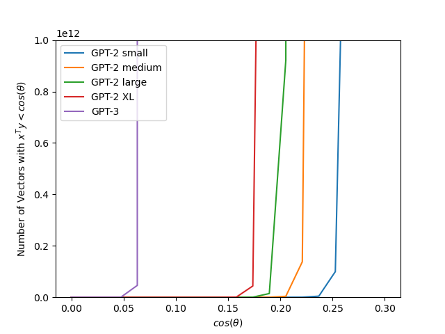
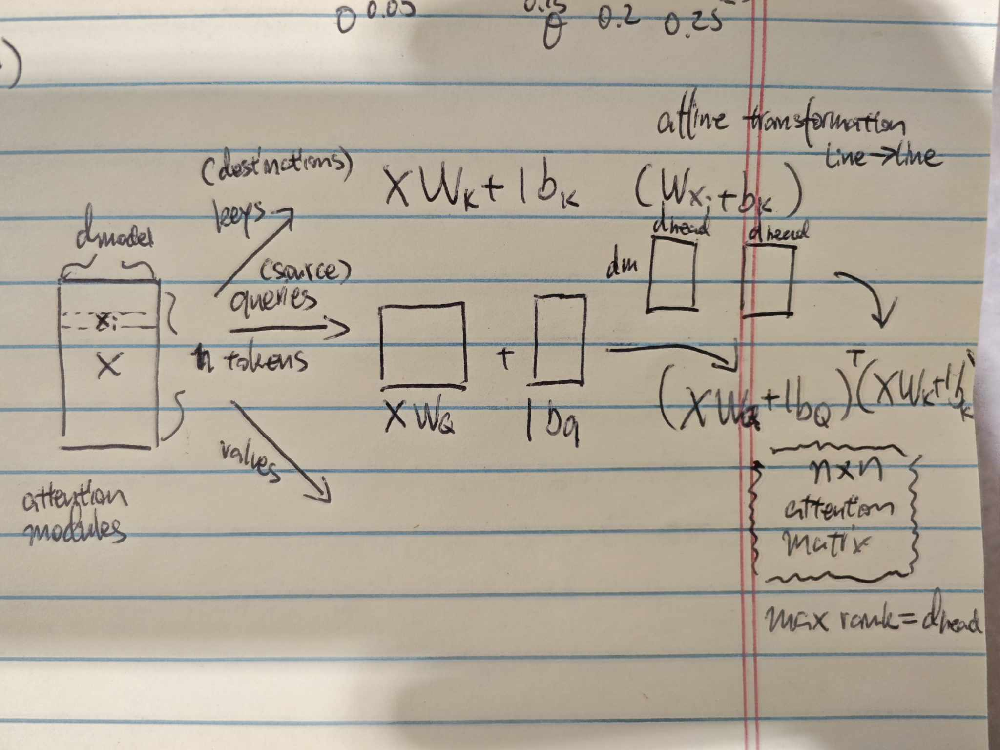

# Math for Transformers
**Fourth lecture: Fri Oct 11**  
Scribe: Peter Tang

## Definition of Bilinear form
A bilinear form on a real vector space V

$f: V \times V \rightarrow K$  assigns value to vector pair $(v_1, v_2)$ in a way that is linear in each vector

### What does linear wrt to x and y mean?

$$f(x,y) \rightarrow \mathbb{R}$$

$$f(ax, y) = af(x,y)$$

$$f(x + z, y) = f(x,y) + f(z,y)$$

and the same thing (linear) in y:

$$f(x, ay) = af(x,y)$$

$$f(x, y+z) = f(x,y) + f(x,z)$$

### Matrix interpretation of biliniear form

Every bilinear form can be expressed as:

$$\langle x, y\rangle = x^T A y$$

If you write out:

$$\left(\begin{array}{cc} 
x_1 & x_2
\end{array}\right)
\left(\begin{array}{cc} 
a_{11} & a_{12} \\
a_{21} & a_{22} \\
\end{array}\right) =
\left(\begin{array}{cc} 
y_1 \\ 
y_2 
\end{array}\right)
$$ 

is equivalent to (in element representation):

$$a_{11} x_1 y_1 + a_{12} x_1 y_2 + a_{21} x_2 y_1 + a_{22} x_2 y_2$$

if you hold $x$ constant, this function in terms of $y$ is linear, and vice versa

### Some types of bilinear forms

- if $\langle w, v\rangle = \langle v, w\rangle$, the bilinear form is symmetric
  * In this case, $A$ is a symmetric matrix
- if $\langle v, v\rangle  > 0$ for all $v$, the bilinear form is positive definite
  * In this case, $A$ is a positive definite matrix

### Inner Product

Definition: an __inner product__ is a symmetric, positive definite bilinear form.  Note that every inner product defines a norm -- i.e., establishes a distance metric on the vector space.  

Note that $x^T y$ is not THE inner product anymore, just a specific instance, where $A = I$.

## Quadratic forms

Now consider if we give a bilinear form the same argument in both positions: 

$$ Q(x) =  \langle x, x \rangle  = \sum a_{ij} x_i x_j  $$

which takes form $x^T A x$.   Keep in mind that $x^T A x$ is just a compact way of writing the quadratic polynomial, in which the coefficient of any term, say $x_i x_j$, is stored in position $(i, j)$ of $A$.

When we consider quadratic forms, always keep in mind the Courant-Fisher Theorem: recall that $\max_{\|x\|=1} x^T A x = \lambda_1$.   This informs how you think about a quadratic form.

To understand a quadratic form: say we are in 2d space: $Q(x) = ax^2$, this is just a parabola opening up. 

If we are in $\mathbb{R}^2$, then a positive definite quadratic form takes on a cup shape, where the 2d xy plane on which the cup sits on is the vector space and the third dimension is the value of the quadratic form.

Higher order quadratic forms behave similarly: a positive definite quadratic form will always have a point of minimum value, analagous to the bottom of a cup.

## Vectors in high dimension

Vectors in high dimension have some counter-intuitive behaviors.  The fundamental reason is that space expands exponentially as you increase the dimension.   However the implications are rather surprising.

To get a sense of scale: in GPT2-small $d_{\text{model}} = 768$, while in GPT3 $d_{\text{model}} = 12,000$.

### Random vectors in high dimensional space are typically nearly orthogonal

This first fact is that if you choose two vectors at random in a high dimensional space, they will typically be nearly orthogonal.  Ie, their inner product will be close to zero.

In other words $x^T y \approx 0$, where $x^T y = \cos \theta$.

Demonstrating this fact depends on how you define a "random vector."   One definition would be random vectors that are sampled from $x \sim N(0, \Sigma)$, where $\Sigma = diag(\sigma^2)$.  You can also think of these as vectors having components sampled i.i.d. from $N(0, \sigma^2$).

then it is not hard to show that if $x$ and $y$ are independent random vectors of this type:

$$\sqrt{n}\, \langle x , y \rangle \rightarrow N(0, \sigma^2) $$

This means that as you increase $n$ (the dimension), the inner product follows a distribution that is narrower and narrower around zero.  In other words, the vectors are almost always nearly orthogonal.

### There is exponential room in high dimension for almost-orthogonal vectors

as dimension n gets bigger and bigger, points tend to distribute at the edge, at which point angles between vectors is more informational than distance

### How many nearly orthogonal vectors are there in high dimensions?
proof sketch: sample a vector, then draw a theta angle around the vector which creates a patch, see how many patch can you fit

Answer: 

$$e^{n\log{\frac{1}{\sin\theta}}}$$

For GPT2-small, number of vectors that have inner products that is 0.25 or greater is trilions of concepts

for GPT3, you only need to have inner product of more than 0.05 to store different concepts (for it to treat as different concepts), so they can work with more minute differences.

### What does this mean for residual stream?

in residual stream, x = (z + y + w), if the inputs don't interact, the output will contain all the input concepts

when expected value of angle is small, two concepts barely affect each other, and it's easier for models to clean them afterwards.

If any vector $x$ gets inserted at one place, it stays in the residual stream because everything is added at each layer (unless it is explicitely taken out)

each token can be thought of as collections of nearly orthogonal vectors, not just a single vector

## What happens inside attention heads

$$(XW_Q + 1 b_Q^T) (X W_K + 1 b_K^T)^T $$ 

results in n X n matrix with max rank d_head

$$X W_Q W_k^T X^T + X W_Q b_K 1^T + 1b_Q^T W_K^T X^T + 1 b_Q b_K 1^T$$

 Note that $x_i^T W_{QK} x_j$ is a bilinear form!

What this means is that $W_{QK}$ stores a set of tasks as eigenvalues, if inputs ($x$) triggers the task, it maximizes the output
of the value $x_i^T W_{QK} x_j$!

    
    

