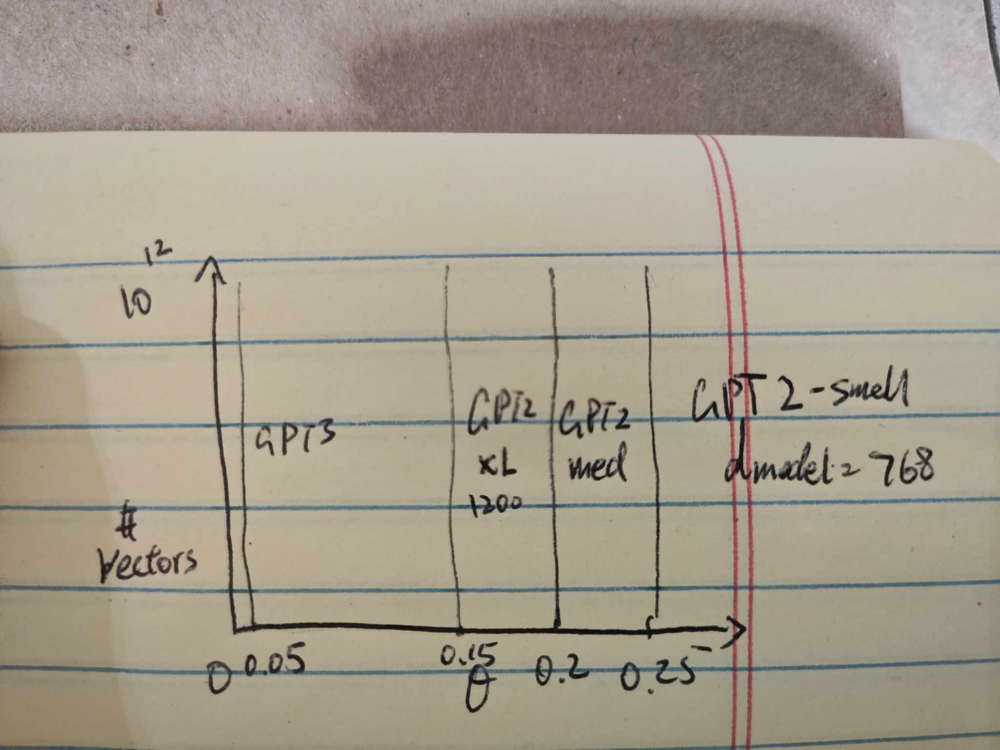

# Oct 11

## Definition of Bilinear form
A bilinear form on a real vector space V

$f: V \times V \rightarrow K$  assigns value to vector pair (v_1, v_2) in a way that is linear in each vector

### What does linear wrt to x and y mean?

$$f(x,y) \rightarrow \R$$

$$f(ax, y) = af(x,y)$$

$$f(x + z, y) = f(x,y) + f(z,y)$$

and the same thing (linear) in y:

$$f(x, ay) = af(x,y)$$

$$f(x, y+z) = f(x,y) + f(x,z)$$

### Matrix interpretation of biliniear form

Every bilinear form can be expressed as:

$$<x, y> = x^T A y$$

If you write out:

[//]: # ([x_1, x_2] [a_11, a_12; a_21, a_22] [y_1; y_2])

$$
\left(\begin{array}{cc} 
x_1 & x_2
\end{array}\right)
\left(\begin{array}{cc} 
a_{11} & a_{12} \\
a_{21} & a_{22} \\
\end{array}\right) 
 = 
\left(\begin{array}{cc} 
y_1 \\ 
y_2 
\end{array}\right)
$$ 

is equivalent to (in element representation):

$$a_{11} x_1 y_1 + a_{12} x_1 y_2 + a_{21} x_2 y_1 + a_{22} x_2 y_2$$

if you hold any of x constant, y is linear, vice versa

### Some properties of bilinear form

- $<w, v> = <v, w>$, they are symmetric
- <v, v> > 0 for all v, positive definite
- inner product is a symmetric, positive, definite bilinear form
  ($x^T y$ is not THE inner product anymore, just a specific instance, where A = I)

## Quadratic form

$$ Q(x) = <x, x> = \sum a_{ij} x_i x_j  $$

which takes form x^T A x

(recall that $\max_{\|x\|=1} x^T A x = \lambda_1)

say if we are in 2d space: Q(x) = ax^2, this is just a parabola opening up

If we are in 3d space, then it's a cup shape, where the 2d xy plane on which the cup sits on is the vector space

## Vectors in high dimension
Space expands exponentially as you increase the dimensions of vectors
(e.g. GPT2-small (768) -> GPT3 (16K))

Random vectors in high dimensional space are typically nearly orthogonal
(i.e. $x^T y = 0$,  where $x^T y = cos \theta$)

If we have random vectors sampled from $x \sim N(0, \Sigma)$, where $\Sigma = diag(\sigma^2)$$

then we have:

$$\sqrt{n}<x,y> \rightarrow N(0, \sigma^2) $$

as you increase the $n$ (dimension), the inner products becomes a distribution that is narrower and narrower (is almost always orthogonal)

### another fact:
as dimension n gets bigger and bigger, points tend to distribute at the edge, at which point angles between vectors is more informational than distance

### How many nearly orthogonal vectors are there in high dimensions?
proof sketch: sample a vector, then draw a theta angle around the vector which creates a patch, see how many patch can you fit
Answer: $e^{n\log{\frac{1}{\sin\theta}}}$

For GPT2-small, number of vectors that have inner products that is 0.25 or grater is trilians of concepts

for GPT3, you only need to have inner product of more than 0.05 to store different concepts (for it to treat as different concepts), so they can work with more minute differences.

### What does this mean for residual stream?

in residual stream, x = (z + y + w), if the inputs don't interact, the output will contain all the input concepts

when expected value of angle is small, two concepts barely affect each other, and it's easier for models to clean them afterwards.

If any vector $x$ gets inserted at one place, it stays in the residual stream because everything is added at each layer (unless it is explicitely taken out)

each token can be thought of as collections of nearly orthogonal vectors, not just a single vector

## What happens inside attention heads

$$(XW_Q + 1 b_Q^T) (X W_K + 1 b_K^T)^T $$ result in n X n matrix with max rank d_head

$$X W_Q W_k^T X^T + X W_Q b_K 1^T + 1b_Q^T W_K^T X^T + 1 b_Q b_K 1^T$$

$x_i^T W_{QK} x_j$ this is bilinear form!

What this means is that $W_{QK}$ stores a set of tasks as eigenvalues, if inputs ($x$) triggers the task, it maximizes the output
of the value $x_i^T W_{QK} x_j$!

    
    

