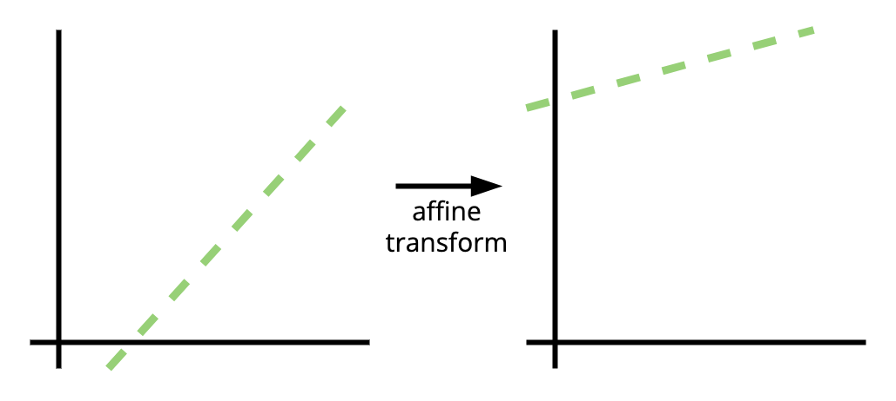
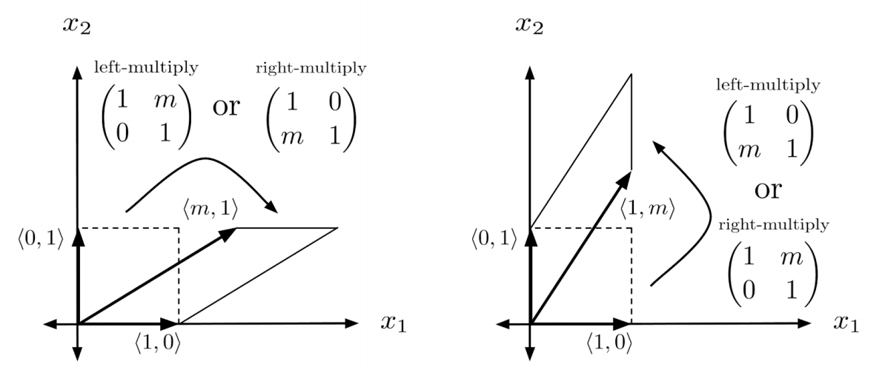

# Math for Transformers

**Fifth lecture: Fri Oct 18**

Scribe : Lucas Tassis

## Remembering the Courant-Fischer Theorem:

$$\underset{\|x\| = 1}{\text{max}} \ x^TAx,$$
where A is a square matrix.

Notice that this is a special case of a bilinear form. Another way of representing this expression is:

$$\underset{\|x\| = 1}{\text{max}} \ \frac{x^TAx}{x^Tx} = \lambda_1,$$

This is called the [Rayleigh quotient](https://en.wikipedia.org/wiki/Rayleigh_quotient).

## Affine transformations

An affine transformation is a transformation that takes lines $\to$ lines.

Notice that a line is not a subspace, therefore, an affine transformation is not a linear transformation (it is not true that $f(x + y) = f(x) + f(y)$)... however, it is pretty close!

**Example:** Shear transformation

A shear transformation is a transformation in the form:

$$S = \begin{bmatrix} 1 & a \\ 0 & 1\end{bmatrix}$$

The figure below presents an example of a shear transformation ([Ref.](https://www.justinmath.com/rescaling-shearing-and-the-determinant/)):

Notice that, when considering the first transformation, the vertical position of the points does not change. If we look at $x_1$, there is only a translation.

The trick of adding another dimension to our coordinates in order to let us implement translation as a linear transformation is called [*homogenous coordinates*](https://en.wikipedia.org/wiki/Homogeneous_coordinates).

## Going back to transformers...

In the previous lecture, we had the expression for an attention module:

$$(XW_Q + \bm{1} \mathbf{b}_Q^T) (X W_K + \bm{1} \mathbf{b}_K^T)^T $$ 

Notice that $\bm{1} \mathbf{b}_Q^T$ and $\bm{1} \mathbf{b}_K^T$ are translations!

Thus, if we consider:

$$X W_Q W_k^T X^T + X W_Q \mathbf{b}_K \bm{1}^T + \bm{1}\mathbf{b}_Q^T W_K^T X^T + \bm{1} \mathbf{b}_Q^T \mathbf{b}_K \bm{1}^T$$

and we use $\tilde{\mathbf{x}}_i = \begin{bmatrix} \mathbf{x}_i \\ 1\end{bmatrix}$ and $\tilde{\mathbf{x}}_j = \begin{bmatrix} \mathbf{x}_j \\ 1\end{bmatrix}$ (homogenous coordinates), we can write this affine transfomation as a linear transformation of the form:

$$\begin{bmatrix} W_Q W_k^T  & W_Q \mathbf{b}_K \\ \mathbf{b}_Q^T W_K^T & \mathbf{b}_Q^T \mathbf{b}_K\end{bmatrix}$$

Finally, we can then re-write the attention score as:

$$A_{ij} = \tilde{\mathbf{x}}_i\Omega\tilde{\mathbf{x}}_j$$

This form reminds us of the Courant-Fischer Theorem! Can we find out something about $\Omega$ using it? Not directly, because the CFT fixes the $\Omega$ and not the vectors $\mathbf{x}$.

Let us consider some points:

1) **Linear representation hypothesis:** features that matter to the attention head are encoded as vectors in subspaces of the residual.
2) **Locally-almost-orthogonal features ([Ref.](https://transformer-circuits.pub/2022/toy_model/index.html#geometry-local-bases)):** models represent correlated features in orthogonal dimensions.

Now we go back to trying to analyze $A_{ij} = \tilde{\mathbf{x}}_i\Omega\tilde{\mathbf{x}}_j$. Like previously stated, we cannot use the Courant-Fisher Theorem because it fixes $\Omega$, and we want to fix $\tilde{\mathbf{x}}_i$ and $\tilde{\mathbf{x}}_j$! Another "variation" of the theorem we can think about is the "SVD version" CF Theorem:

$$\underset{\|x\| = 1, \|y\|=1}{\text{max}} \ x^TAy = \sigma_1,$$
where $x = u_i$ and $y = v_i$.

This still considers a fixed $A$, so it cannot be applied to $\Omega$! 

To solve this, let us consider the following Lemma:

**Lemma:** Given vectors $\mathbf{x}$ and $\mathbf{y}$ among all rank 1 matrices having unit Frobenius norm, the matrix $D$ that maximizes $\mathbf{x}^TD\mathbf{y}$ is:

$$D = \frac{\mathbf{x}}{\|\mathbf{x}\|} \cdot\frac{\mathbf{y^T}}{\|\mathbf{y}\|}$$

We can notice then, that the optimization problem of the transformer is trying to maximize this process!

If we consider:

$$\tilde{\mathbf{x}}_i = \mathbf{v}_i + \mathbf{f_i}, \mathbf{v_i} \perp \mathbf{f_i}$$
$$\tilde{\mathbf{x}}_j = \mathbf{v}_j + \mathbf{f_j}, \mathbf{v_j} \perp \mathbf{f_j}$$

Then maximizing $\mathbf{x}_i\Omega\tilde{\mathbf{x}}_j$ is maximizing $\Omega = \frac{\mathbf{f}_i}{\|\mathbf{f}_i\|} \cdot\frac{\mathbf{f_j^T}}{\|\mathbf{f_j}\|}$.

Thus, the optimization process is copying the features we are looking for into $\Omega$!

Finally, we can write the SVD of $\Omega$ as:

$$\Omega = \sum\limits_{k=0}^{r-1} \mathbf{u}_k \sigma_k \mathbf{v}_k^T = \sum\limits_{k=0}^{r-1} D_k$$

Notice that $D_k^TD_j = D_j^TD_k = 0$ whenever $k \neq j$ (operating in different subspaces).

