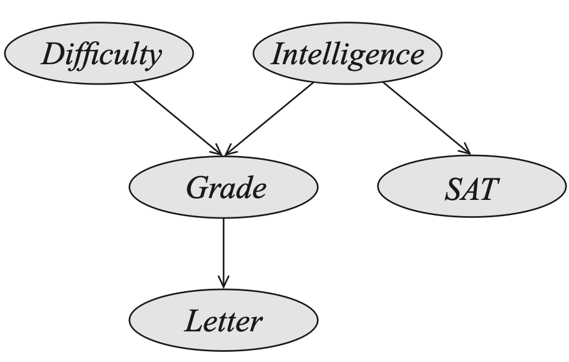
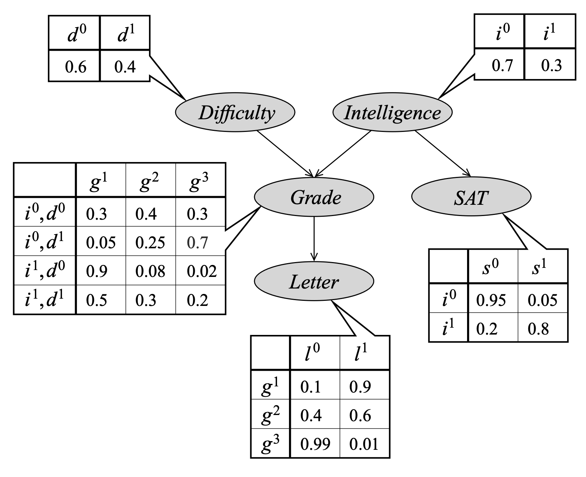
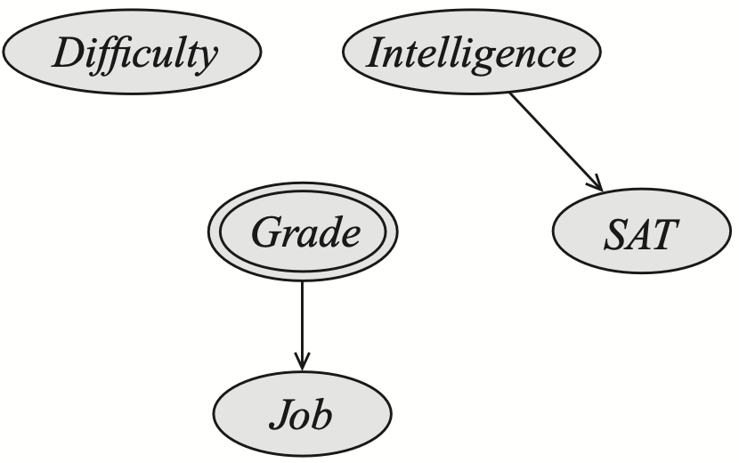
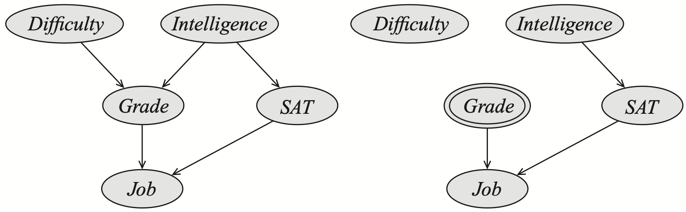

# Math for Transformers

**Fifth lecture: Fri Nov 1**

Scribe : Lucas Tassis

## Introduction

Why should we learn causal models for LLMs?

1. We can build causal models for internal processes of an LLM; or
2. LLM can itself be viewed as a causal model.

Two important people in the development of causal models in computer science were:

- Judea Pearl: won a Turing award for his work.
- Daphne Koller: the content of these notes were based on her book *Probabilistic Graphical Models: Principles and Techniques*

## Probabilistic Graphical Models or Bayesian Networks

*(The figures and part of the content in this section were based on the book Probabilistic Graphical Models: Principles and Techniques)*

The motivation of creating a graphical model is to try to capture a high dimensional distribution. One interesting thing is that in the real world, sometimes they have a structure that helps us!

Let us consider an example of a student. Consider we have five random variables in our scenario:

$\mathrm{Intelligence} = \{\mathrm{high}, \mathrm{low}\}$

$\mathrm{Course} = \{\mathrm{hard}, \mathrm{easy}\}$

$\mathrm{SAT} = \{\mathrm{high}, \mathrm{low}\}$

$\mathrm{Grade} = \{\mathrm{A}, \mathrm{B}, \mathrm{C}\}$

$\text{Letter of Recommendation} = \{\mathrm{strong}, \mathrm{weak}\}$

First, notice that even in this "simple" example, if we had to write a joint distribution, we would have to create a table with 48 entries. However, if we had this table, we would be able to answer any observational question (via marginalization and/or conditioning).

Can we try to capture the same information more compactly? Unfortunately in general, we cannot.  However, in the real world, we might be able to exploit some relations or restrictions to the variables! This is where graphical models helps us. 

Notice that in this graph, we had to make some assumptions about the world. For instance, $\mathrm{Difficulty}$ and $\mathrm{Intelligence}$ are independent! However, by creating this graph, we can now specify our joint distribution with:

Notice that we specified the whole joint distribution (that previously had 48 entries), with only 26 entries. How we did that? By making independence assumptions.

Now that we have this new table, we can construct the whole previous table with only this information. How do we do that? By using the *probability chain rule*:

$$P[A, B] = P[A \mid B] P[B]$$

Notice that with this rule, we can build any state of the joint probability. In general we will have:

$$P[I, C, S, G, L] = P[L \mid G] P[S \mid I] P[G \mid I, D] P[I] P[D]$$

With this expression, we can answer any observational question!

One important point is that by assuming this model is true, we are assuming *causality*.

Now that we established this model, if we wanted to ask how likely a random student is to get a strong recommendation? We could just compute:

$$P[L] = \sum_{\{G, I, D\}} P[L \mid G] P[G \mid I, D] P[I] P[D]$$

When we predict the *downstream* effects of various factors, this is called **causal reasoning**. We applied causal reasoning to the graph by following the arrows!

Now let's suppose that a recruiter is trying to decide whether they should hire the random student based on this model: if we can see the letter, can we go back to the intelligence? In other words, can we go from $P[L \mid I] \rightarrow P[I \mid L]$? Yes! By using Bayes' Rule!

When we reason from effect to causes (go *upstream* in the graph), we call this **evidential reasoning** or **explanation**.

## Causal Models

Now that we have some background on PGMs, we focus our attention on causal models. Imagine we have questions like:

1.  "If a patient takes the madication what is the chance of recovery?"
2. "Does smoking cause cancer?"

These are questions that cannot be answered by the tactics showed in the previous section, because we what asking *what if*, we are not simply observing things. Therefore, all we can get using PGMs are *correlation*!

For example, imagine that in the example previously showed, the random student hired a hacker to change his grade to an "A" in order to get a better letter of recommendation. 

This is called a **do-intervention**, and it is a type of **causal intervention**. 

To predict the effects of a do-intervention like $\mathrm{do(}X=x\mathrm{)}$, we must do the following:
1. Set the intervened variable to the value, ie, set $X$ to the value $x$.   This can be thought of as replacing the distribution of the variable $X$ with a new one that is constant for $x$.
1. Erase all incoming edges to the variable $X$.

In the case of the hacker-changed grade, the result would be a model where the student's grade is not determined by their performance anymore, thus our graphical model would look like:

Notice that we do not have arrows connecting $\mathrm{Difficulty}$ and $\mathrm{Intelligence}$ to $\mathrm{Grade}$ anymore. Notice that $P[S \mid \mathrm{do(}G=\mathrm{A})]$ is still the same as the one in the previous network, and the probability of the letter would be $P[L \mid \mathrm{}G=\mathrm{A}]$.

Assume now that we have a slightly different graph, and we do the same intervention:

In this case, the answer to the query $P[L \mid \mathrm{do(}G=\mathrm{A})]$ is not the same as $P[L \mid \mathrm{}G=\mathrm{A}]$, because the probability of the letter also depends on the SAT score. Thus, $P[L \mid \mathrm{do(}G=\mathrm{A})]$ is not a value we can get from any computation on the probabilistic model!

Finally, one important concept is that, in this last scenario $\mathrm{Intelligence}$ is a **confounding factor**. A confounder is a variable that induces correlation between observed variables, where there is not a causal relations between them.

## Why is all of this important for LLMs?

The concepts presented are important to our study of LLMs, because, if consider the structure of a LLM as a causal model, we can make interventions (like *patching*) to analyze the relationship between the structures (attention heads, MLPs, etc.)

