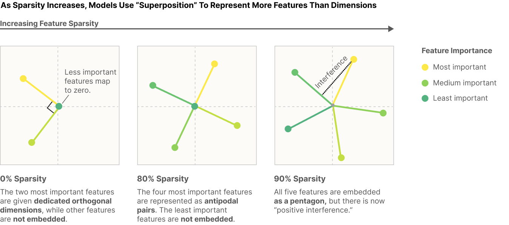
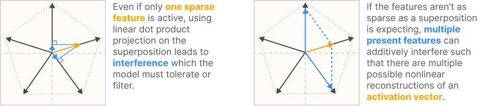
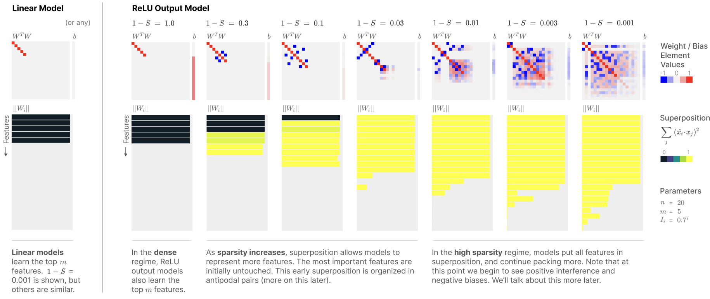

# Toy Models of Superposition (discussion)

**Seventh lecture: Fri Dec 6**

Scribe : Gabrel Franco

Full paper available [here.](https://transformer-circuits.pub/2022/toy_model/index.html)

## Introduction

The toy model definition is the following:

$\text{ReLU}(W^T Wx + b)$

The model is trained using the following loss function:

$L = \sum_{x} \sum_{i} I_i (x_i - x'_i)^2$, where $I_i$ is the importance of a feature $i$.

## Sparsity and its relation to the feature direction

When there is no sparsity, only the most important features are represented. As the sparsity increases, the model represents more features than dimensions.

## Features and superposition hypothesis

On the left side, when one sparse feature is active, the feature has small interference in other features and the model has to tolerate it. 

On the right side, if the features are not sparse as expected, multiple features can be presented, and an activation vector (in orange) can be reconstructed by a sum of multiple features (in blue).

## Most interesting result

There is definetely a trade-off between representing features and the loss. As the spartity increases, the model has mode "incentive" to represent more features in superposition. In the other hand, with no sparsity, the model represents only the most important features, since they are the largest terms in the loss function. Moreover, we can also see the structure of the superposition in the heatmaps. In the case $1 - S = 0.1$, we definetely see the "anti-podal" pairs structure.

## Discussion about what next

We also discussed possible follow-ups to this paper.

- Do something like that for an AH:
    * Train AH in pairs of vectors (it could be synthetic data).
    * The AH would organize attention matrix to create SVs that correspond to features that you want to learn.
    * SVs of AH represents concepts in the model representation.

## Interesting paper to follow-up:

[A mathematical theory of semantic development in deep neural networks.](https://www.pnas.org/doi/10.1073/pnas.1820226116)

